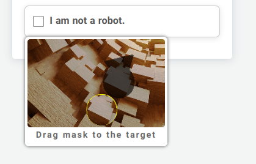

# ACaptcha

ACaptcha is a smart CAPTCHA solution designed to provide an easy and secure way to protect your web forms, similar to Google reCAPTCHA v2. Built with Laravel, ACaptcha is lightweight and user-friendly.



## Features

-   **Smart CAPTCHA**: Advanced algorithms to distinguish between human users and bots.
-   **Easy Integration**: Simple to implement in your Laravel forms.
-   **Customizable**: Publish your own JavaScript, CSS, and images for masks and backgrounds.

## Installation

1.  **Install ACaptcha** via Composer:
```
composer require angus-dv/captcha
```

2. **Publish Assets**:

After installation, you need to publish the necessary JavaScript, CSS, and image assets:

    php artisan vendor:publish --tag=acaptcha

## Usage

### 1. Displaying the CAPTCHA

To include the CAPTCHA in your form, simply use the following HTML code:

    <form  class="card"> 
     @include('ACaptcha::show')
    </form>

### 2. Verifying the CAPTCHA

You can verify the CAPTCHA on the backend using Laravel's validation rules. Use the `ACaptchaVerify` rule in your validation logic:
```
$request->validate([ 
	'a_captcha_hash_salt' => ['required', 'a_captcha_verify'],
 ]);
 
 or
 
$request->validate([ 
	'a_captcha_hash_salt' => ['required', new ACaptchaVerify],
 ]);
```
Alternatively, you can use the helper function to verify the CAPTCHA:
```
if (a_captcha_verify($request->input('a_captcha_hash_salt'))) { 
	// CAPTCHA verified successfully 
} else { 
	 // CAPTCHA verification failed 
}
```


## Conclusion

ACaptcha is designed to be straightforward and powerful, making it a great addition to your Laravel application. Protect your forms and enhance security with minimal effort!

For further support or contributions, feel free to reach out or check the issues page.
